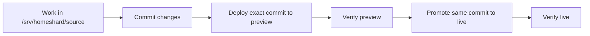

# Homeshard Environment Cleanup

This document records the current deployment layout and the target shape for
turning the live, preview, and source copies into one predictable workflow.

## Goal

Homeshard should have one canonical source repo and separate deployment
environments:

- `source`: where development happens
- `preview`: where changes are tested before promotion
- `live`: what users actually use

Code should move by commit promotion. Runtime data should stay separate per
environment.

## Current Reality

As of the completed migration:

| Environment | Port | Containers | Compose project | Code path | Runtime path |
| --- | ---: | --- | --- | --- | --- |
| live | `8010` | `homeshard-live-web-1`, `homeshard-live-agent-1`, `homeshard-live-postgres-1` | `homeshard-live` | `/srv/homeshard/deploy/live` | `/srv/homeshard/runtime/live` |
| preview | `8012` | `homeshard-preview-web-1`, `homeshard-preview-agent-1`, `homeshard-preview-postgres-1` | `homeshard-preview` | `/srv/homeshard/deploy/preview` | `/srv/homeshard/runtime/preview` |

Important notes:

- `/srv/homeshard/instances` currently exists but is empty.
- `/srv/server-manager/instances` is retained as a rollback source, but normal
  live operation now uses `/srv/homeshard/runtime/live/instances`.
- `/srv/homeshard-preview` is retained as a rollback source, but normal preview
  operation now uses `/srv/homeshard/runtime/preview`.
- The old `8011` mock/redesign stack has been stopped.
- The first normalized live/preview deployment is pinned to commit `cc4c9ef`.
  It intentionally reuses the existing local Docker images to avoid mixing the
  structure migration with an unrelated rebuild from a dirty worktree.

Known instance notes:

- `e8a6db5e-31f8-4613-831f-5de1022556d1` appears to be a test/end-to-end
  instance rather than an important player world. It is still included in the
  pre-migration backup for safety.

## Target Structure

```text
/srv/homeshard/
  source/
    # canonical git repo

  deploy/
    live/
      # deployment worktree for the exact live commit
    preview/
      # deployment worktree for the exact preview commit

  runtime/
    live/
      instances/
      cold/
      staging/
      missing-mods/

    preview/
      instances/
      cold/
      staging/
      missing-mods/

  config/
    live.env
    preview.env
```

`/srv/server-manager` should eventually stop being required for normal
operation after the live runtime data has been migrated or adopted under
`/srv/homeshard/runtime/live`.

## Workflow



Rules:

- Edit only `/srv/homeshard/source`.
- Treat `/srv/homeshard/deploy/live` and `/srv/homeshard/deploy/preview` as
  generated deployment checkouts.
- Never manually patch files in deployment checkouts.
- Preview and live must never share writable runtime folders.
- Promotion means "put the exact preview-tested commit on live."

## Recommended Environment Values

Live:

```text
COMPOSE_PROJECT_NAME=homeshard-live
WEB_PORT=8010
POSTGRES_DB=homeshard
HOST_INSTANCES_DIR=/srv/homeshard/runtime/live/instances
HOST_COLD_DIR=/srv/homeshard/runtime/live/cold
HOST_STAGING_DIR=/srv/homeshard/runtime/live/staging
HOST_MISSING_MODS_DIR=/srv/homeshard/runtime/live/missing-mods
HOMESHARD_AGENT_ID=homeserver-live
HOMESHARD_GAME_PORT_START=25600
HOMESHARD_GAME_PORT_END=25699
```

Preview:

```text
COMPOSE_PROJECT_NAME=homeshard-preview
WEB_PORT=8012
POSTGRES_DB=homeshard_preview
HOST_INSTANCES_DIR=/srv/homeshard/runtime/preview/instances
HOST_COLD_DIR=/srv/homeshard/runtime/preview/cold
HOST_STAGING_DIR=/srv/homeshard/runtime/preview/staging
HOST_MISSING_MODS_DIR=/srv/homeshard/runtime/preview/missing-mods
HOMESHARD_AGENT_ID=homeserver-preview
HOMESHARD_GAME_PORT_START=25700
HOMESHARD_GAME_PORT_END=25799
```

## Execution Phases

### Phase 1: Make the Current State Visible

- Keep this document updated with the latest audit.
- Use `scripts/status-envs` before and after any deployment change.
- Do not move runtime data yet.

Status: completed for the first pass.

### Phase 2: Create Stable Folders

Create the target `/srv/homeshard/runtime`, `/srv/homeshard/deploy`, and
`/srv/homeshard/config` folders. This is non-destructive.

Status: completed. The target folders exist and are owned by the regular
Homeshard user.

### Phase 3: Normalize Config

Create real env files from:

- `infra/homeserver/.env.live.example`
- `infra/homeserver/.env.preview.example`

Store the real files outside the repo:

- `/srv/homeshard/config/live.env`
- `/srv/homeshard/config/preview.env`

Status: completed.

Real env files:

- `/srv/homeshard/config/live.env`
- `/srv/homeshard/config/preview.env`

These files contain secrets and should stay outside git.

### Phase 4: Establish Deployment Worktrees

Create deployment worktrees under:

- `/srv/homeshard/deploy/live`
- `/srv/homeshard/deploy/preview`

The worktrees should point at explicit commits or controlled deployment
branches. They should not be used for development.

Status: completed.

Deployment worktrees:

- `/srv/homeshard/deploy/live`
- `/srv/homeshard/deploy/preview`

Both are currently pinned to `cc4c9ef`.

### Phase 5: Preview First

Move preview to the target runtime paths first:

```text
/srv/homeshard-preview/instances -> /srv/homeshard/runtime/preview/instances
/srv/homeshard-preview/cold      -> /srv/homeshard/runtime/preview/cold
```

Then start preview from `/srv/homeshard/deploy/preview` using
`/srv/homeshard/config/preview.env`.

### Phase 6: Live Migration

Schedule a maintenance window before touching live runtime data.

Current live-like data likely maps as:

```text
/srv/server-manager/instances -> /srv/homeshard/runtime/live/instances
/mnt/nextcloud/server-manager -> /srv/homeshard/runtime/live/cold
```

Before changing live:

- stop the live agent so it cannot mutate instance folders during sync
- sync data to the target folder
- update env values
- restart live from `/srv/homeshard/deploy/live`
- verify Minecraft containers mount the new folders

Keep `/srv/server-manager` as a rollback source until several successful
restarts have passed.

Pre-migration backup status:

- Created: `/mnt/nextcloud/server-manager/migration-backups/pre-migration-20260711-073822`
- Source: `/srv/server-manager/instances`
- Database dump: `homeshard.dump` from `homeshard-test-postgres-1`
- Verified: source and backup file lists both contain 10,823 files, the diff is
  empty, and the final rsync dry-run is empty.
- Included instances:
  - `a841b47c-3b0f-4811-b634-a6ca34cb2fcf`
  - `c78f78ea-c4eb-4f1f-ac53-481ebeddfbfe`
  - `daa33ad7-d502-43df-a19c-4f5100987bd1`
  - `e15c68a9-218e-4ae4-b91c-13e13ad68e33`
  - `e8a6db5e-31f8-4613-831f-5de1022556d1` test/end-to-end instance

Cutover status:

- Preview was copied from `/srv/homeshard-preview` to
  `/srv/homeshard/runtime/preview` and restarted from
  `/srv/homeshard/deploy/preview`.
- Live active instances were copied from `/srv/server-manager/instances` to
  `/srv/homeshard/runtime/live/instances`.
- Live cold storage was copied from `/mnt/nextcloud/server-manager` to
  `/srv/homeshard/runtime/live/cold`, excluding `migration-backups/`.
- Live was restarted as compose project `homeshard-live` from
  `/srv/homeshard/deploy/live`.
- A fresh cutover database dump was written to the path recorded in
  `/srv/homeshard/config/live-cutover-dump.path`.
- Live database `cold_path` values were rewritten from
  `/mnt/nextcloud/server-manager/...` to
  `/srv/homeshard/runtime/live/cold/...`.
- Verification after rewrite showed zero remaining old cold paths.
- The stopped live Minecraft server containers were recreated with the same
  names and new bind mounts under `/srv/homeshard/runtime/live`. This matters
  because sleeping proxies wake instances by starting those stopped containers.
- Post-migration scan fixed two fragile leftovers:
  - `CF_API_KEY` in `/srv/homeshard/config/live.env` was restored and
    compose-escaped correctly so future CurseForge deploys/imports work.
  - Preview backup `cold_path` values and the preview stopped wake container
    were moved from `/srv/homeshard-preview` to
    `/srv/homeshard/runtime/preview`.
- Follow-up verification showed all non-trashed live and preview pack/backup
  paths exist under their new runtime roots.

## Verification Checklist

For preview:

- web loads on `8012`
- agent starts
- database connects
- runtime paths point at `/srv/homeshard/runtime/preview`
- preview cannot write to live runtime folders
- game ports stay in the `25700-25799` range

For live:

- web loads on `8010`
- agent starts
- database connects
- runtime paths point at `/srv/homeshard/runtime/live`
- existing instances are visible
- existing Minecraft containers mount the intended instance folders
- game ports stay in the `25600-25699` range

## Helper Scripts

- `scripts/status-envs`: audits current Homeshard containers, ports, env values,
  mounts, git worktrees, and runtime sizes. Secret-like values are masked.
- `scripts/bootstrap-env-layout`: creates the target `/srv/homeshard` runtime,
  deploy, and config folders.
- `scripts/deploy-preview [commit]`: creates or updates the preview deployment
  worktree and starts preview from `/srv/homeshard/config/preview.env`.
- `scripts/promote-live [commit]`: promotes the preview-tested commit, or an
  explicit commit, to live using `/srv/homeshard/config/live.env`.

The deploy scripts are intentionally guarded. They fail if their env file is
missing or if the target deployment worktree has local changes.

## Done Means

- there is one canonical source repo
- live and preview are deployment checkouts
- live and preview have separate runtime folders
- container names match their roles
- ports match their roles
- `/srv/server-manager` is not required for normal operation
- `scripts/status-envs` can answer what is running and where
